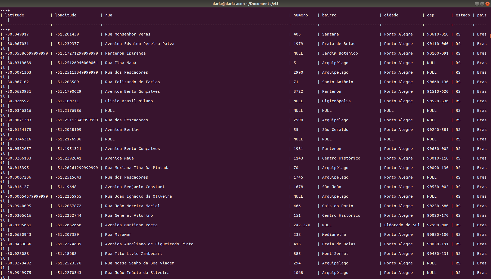

*Implementado em Python 3.7.4*


### Organização dos módulos
  
Esse projeto está organizado da seguinte forma:
  
```
challenge-etl  
|__ __main__.py
|__ README.md  
└─── ETL  
    |___ etl.py    
    └─── processes  
         │___ __init__.py  
         │___ data_transformation.py  
         |___ database.py  
         |___ file_transformation.py  
         |___ maps_api.py
         └─── tests  
         |         │___ __init__.py  
         |         │___ test_data_transformation.py  
         |         |___ test_database.py  
         |         |___ test_file_transformation.py  
         |         └─── test_maps.api.py
         |         |___ data_points.txt
         |         |___ data_points2.txt
         |
         └─── data  
                  │___ data_points_20180101.txt 
                  │___ data_points_20180102.txt  
                  |___ data_points_20180103.txt    
 
```  
Como o processo de ETL possui etapas bem demarcadas, quis modularizar o máximo possível minha solução.
Começando pela primeira etapa, recebi arquivos com dados no seguinte formato:

```
Latitude: 30°02′59″S   -30.04982864
Longitude: 51°12′05″W   -51.20150245
Distance: 2.2959 km  Bearing: 137.352°
```
  
Como o Google Maps API, que foi utilizado para essa solução, só necessita dos valores de latitude e longitude em decimal,
`file_transformation.py` é o módulo que lida com a organização desses dados para o seguinte formato:

```
	           latitude 	longitude
        index
        0 	-30.04982864 	-51.20150245
        1 	-30.06761588 	-51.23976111
        2 	-30.05596474 	-51.17286827
        3 	-30.03841576 	-51.24943145
```
Tendo esse formato, é fácil passar um por um desses valores para o API do Google Maps e obter as informações para esses 
pares de latitude e longitude.
  
Em `maps_api.py`, é feita a conexão com o Google Maps Reverse Geocoding API. Para cada par latitude/longite é devolvido 
pelo API vários endereços, então o método `GoogleMapsAPI.reverse_geocoding()` assegura que sempre
o primeiro valor enviado pelo API vai ser salvo, pois segundo o *Developers Guide* do Google, esses resultados são os mais precisos.
   
Os dados do API vêm muito sujos e precisam passar por uma limpeza. O módulo `data_transformation.py` é responsável por
organizar os dados de uma forma que fique adequada para passar para a database depois. O RDBMS utilizado foi o *MySQL*.
  
OBS.: Em alguns métodos, os dataframes que eram formados durante os processos estão para serem salvos em arquivos `.xlsx` para 
"debugar" durante a implementação. Esses arquivos estão salvos na pasta `data` e as linhas de código que os produzem foram
comentadas para não serem executadas.  
 
 
### Database

O banco de dados ficou no formato:
  



### Como executar 

Se você está num sistema operacional que já utiliza Python 3 como o padrão, pode utilizar apenas python nos comandos.  
No Terminal:  
  
```
$ cd ./ETL
$ python etl.py
```

ou

```
$ cd./ETL
$ python3 etl.py
```

Para executar os testes:

```
$ cd ./ETL
$ python -m unittest
```

ou

```
$ cd./ETL
$ python3 -m unittest
```


### Bônus

> Além do enriquecimento proposto, que análises poderiam ser feitas utilizando essa massa de dados? Que métricas poderiam ser obtidas?  
  
Sem saber a finalidade que será utilizada a aplicação, é difícil saber quais outras análises seriam úteis.
Mas, se a aplicação estivesse no contexto de mobilidade urbana, seria possível cruzar as informações com os
[Dados abertos da Prefeitura](http://datapoa.com.br/group/mobilidade) sobre acidentes e fazer algumas análises, como:
- número de acidentes em determinado bairro/rua/avenida por mês (métrica de quantidade absoluta);
- % de acidentes por bairro (métrica de quantidade relativa);
- das localidades analisadas, qual foi a mais propensa a ter acidentes em um determinado intervalo de tempo.
 
Mas se a aplicação quiser inferir alguma informação demográfica sobre as pessoas cujas coordenadas estão sendo analisadas,
seria possível cruzar com dados do IBGE e estimar, por exemplo, a renda média da pessoa que mora em determinado bairro da 
cidade.
  
Ainda, mesmo sem fazer uso de dados adicionais, utilizando os dados fornecidos, é possível utilizar as informações de `distance` e
`bearing` para calcular o destino de cada coordenada inicial (latitude e longitude). Sendo `distance` a distância em km que 
determinada pessoa percorreu, e `bearing` o ângulo, é possível saber com precisão onde a pessoa foi, dado o ponto inicial.
